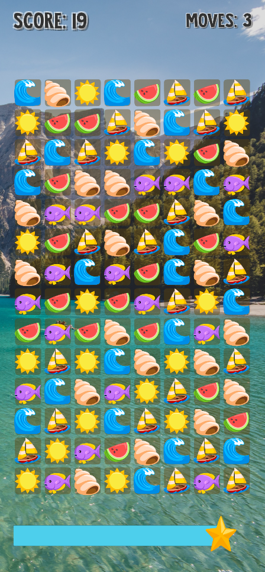
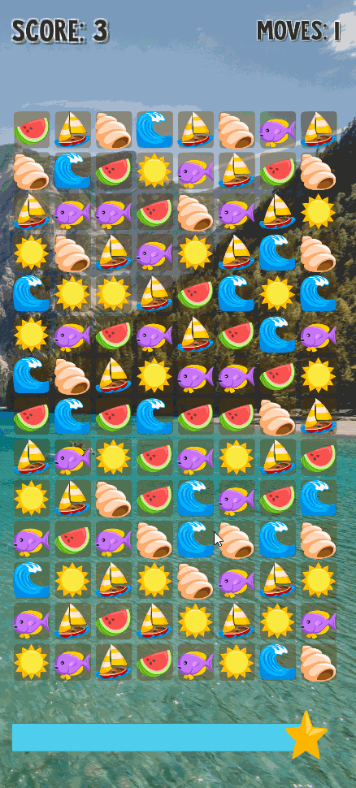

  <h1>Beach Crush</h1>

 
  

**Table of content**
- [Game Summary](#game-summary)
- [Description](#description)
- [Visual Style](#visual-style)
- [Player Objectives](#player-objectives)

# Game Summary

**Common Information**

**Target Audience:** All ages  
**Genre:** Puzzle  
**Engine:** Unity  
**Release Platform:** NA  
**Release Store:** NA  

# Description

Candy Crush like game from platzi, create rows or columns of 3 of more of the same kind of figure.

# Visual Style
Cartoony Beach.

# Player Objectives
- Score points by matching rows or columns
- Play fast and don't let the time finish

